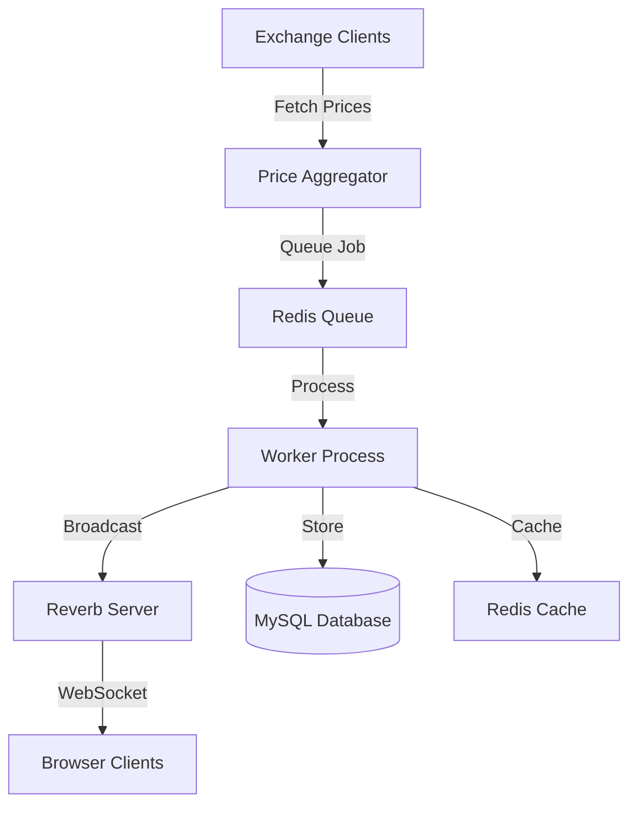

# Crypto Price Aggregator

A real-time cryptocurrency price aggregator built with Laravel, featuring WebSocket communication via Laravel Reverb for live updates.

---

## Project Overview

The Crypto Price Aggregator is a robust system that:
- **Fetches cryptocurrency prices** from multiple exchanges (Binance, MEXC, Huobi)
- **Aggregates and processes** price data in real-time using a weighted average algorithm
- **Broadcasts updates** via WebSocket using Laravel Reverb for live updates
- **Provides a responsive UI** with real-time updates using Laravel Livewire and AlpineJS

---

## Technology Stack

- **PHP:** 8.2+
- **Framework:** Laravel 11.x
- **Database:** MySQL 8.0+
- **Cache/Queue:** Redis
- **WebSocket:** Laravel Reverb
- **Frontend:** Laravel Livewire, AlpineJS
- **Process Manager:** Supervisor (for production)
- **Containerization:** Docker & Docker Compose
- **Web Servers:** Apache/Nginx (configurable via containers)

---

## Prerequisites

- [Docker](https://docs.docker.com/get-docker/)
- [Docker Compose](https://docs.docker.com/compose/install/)
- Git

> **Note:** This project is entirely containerized. All dependencies—including MySQL, Redis, Nginx, and the Reverb WebSocket server—run in isolated containers without modifying your host system.

---

## Quick Start with Docker

Follow these steps to set up and run the application locally in a non-invasive manner:

1. **Clone the Repository**

   ```bash
   git clone https://github.com/soles21/crypto_price_tracker.git
   cd crypto_price_tracker
   ```

2. **Copy the Environment File**

   ```bash
   cp .env.example .env
   ```

3. **(Optional) Adjust Your .env for Local Reverb**

   Ensure your `.env` file has the following relevant settings for local Reverb usage:

   ```dotenv
   APP_ENV=local
   DB_HOST=mysql
   DB_PORT=3306
   DB_DATABASE=crypto_tracker
   DB_USERNAME=root
   DB_PASSWORD=secret
   CACHE_DRIVER=redis
   QUEUE_CONNECTION=redis
   BROADCAST_DRIVER=reverb
   ```

4. **Start the Containers**

   This command will build and run all necessary services (app, MySQL, Redis, Nginx, and Reverb).

   ```bash
   docker-compose up -d
   ```

5. **Run Migrations**

   Execute the migrations inside the app container:

   ```bash
   docker-compose exec app php artisan migrate
   ```

6. **Generate the Application Key**

   ```bash
   docker-compose exec app php artisan key:generate
   ```

7. **Access the Application**

   Open your browser and navigate to [http://localhost](http://localhost).

---

## Local Setup for Reverb

The Reverb WebSocket server is containerized as a separate service to handle real-time updates. It uses the same codebase but runs a dedicated command.

- **Reverb Service in Docker Compose:**  
  The `reverb` service (see below) runs:
  
  ```bash
  php artisan reverb:start --debug
  ```

- **Environment Setup:**  
  The `.env` file must have `BROADCAST_DRIVER=reverb` along with your usual database, Redis, and other configurations (see above).

- **Local Testing:**  
  Once the containers are up (with `docker-compose up -d`), the Reverb server starts automatically. To check its status, use:
  
  ```bash
  docker-compose logs reverb
  ```

---

## Docker Configuration

### docker-compose.yml

```yaml
version: '3.8'

services:
  app:
    build:
      context: .
      dockerfile: Dockerfile
    environment:
      - APP_ENV=local
      - DB_HOST=mysql
      - DB_PORT=3306
      - DB_DATABASE=crypto_tracker
      - DB_USERNAME=root
      - DB_PASSWORD=secret
      - CACHE_DRIVER=redis
      - QUEUE_CONNECTION=redis
      - BROADCAST_DRIVER=reverb
    volumes:
      - .:/var/www
    depends_on:
      - mysql
      - redis

  mysql:
    image: mysql:8.0
    restart: always
    environment:
      MYSQL_DATABASE: crypto_tracker
      MYSQL_ROOT_PASSWORD: secret
    volumes:
      - mysql-data:/var/lib/mysql

  redis:
    image: redis:alpine
    restart: always
    volumes:
      - redis-data:/data

  nginx:
    image: nginx:alpine
    restart: always
    ports:
      - "80:80"
      - "443:443"
    volumes:
      - .:/var/www
      - ./docker/nginx/conf.d/:/etc/nginx/conf.d/
    depends_on:
      - app

  reverb:
    build:
      context: .
      dockerfile: Dockerfile
    command: php artisan reverb:start --debug
    environment:
      - APP_ENV=local
      - DB_HOST=mysql
      - DB_PORT=3306
      - DB_DATABASE=crypto_tracker
      - DB_USERNAME=root
      - DB_PASSWORD=secret
      - CACHE_DRIVER=redis
      - QUEUE_CONNECTION=redis
      - BROADCAST_DRIVER=reverb
    volumes:
      - .:/var/www
    depends_on:
      - app
      - redis

volumes:
  mysql-data:
  redis-data:
```

### Dockerfile

```dockerfile
FROM php:8.2-fpm

# Install base dependencies
RUN apt-get update && apt-get install -y \
    git \
    curl \
    libpng-dev \
    libonig-dev \
    libxml2-dev \
    zip \
    unzip \
    nodejs \
    npm

# Install PHP extensions
RUN docker-php-ext-install pdo_mysql mbstring exif pcntl bcmath gd

# Copy Composer from the official image
COPY --from=composer:latest /usr/bin/composer /usr/bin/composer

# Set working directory and copy project files
WORKDIR /var/www
COPY . .

# Install PHP and Node.js dependencies and build assets
RUN composer install --no-dev --optimize-autoloader
RUN npm install && npm run build

# Default command (overridden by specific services in docker-compose)
CMD ["php-fpm"]
```

### Nginx Configuration (docker/nginx/conf.d/default.conf)

```nginx
server {
    listen 80;
    server_name localhost;
    root /var/www/public;

    index index.php index.html;

    location / {
        try_files $uri $uri/ /index.php?$query_string;
    }

    location ~ \.php$ {
        fastcgi_pass app:9000;
        fastcgi_index index.php;
        fastcgi_param SCRIPT_FILENAME /var/www/public$fastcgi_script_name;
        include fastcgi_params;
    }

    # WebSocket configuration for Reverb
    location /app/ {
        proxy_pass http://127.0.0.1:8080;
        proxy_http_version 1.1;
        proxy_set_header Upgrade $http_upgrade;
        proxy_set_header Connection "upgrade";
        proxy_set_header Host $host;
        proxy_cache_bypass $http_upgrade;
    }
}
```

---

## System Architecture

### Core Components

- **Price Fetching Layer:**  
  Contains exchange clients for Binance, MEXC, and Huobi along with a Price Aggregator Service that fetches and aggregates data.

- **Data Processing Layer:**  
  Uses Redis for queuing jobs (asynchronous processing of price updates) and caching. Processed data is broadcasted via the Reverb WebSocket server.

- **Database Layer:**  
  MySQL stores historical price data, exchange metadata, and aggregated statistics.

- **Frontend Layer:**  
  Real-time UI updates are provided via Laravel Livewire and AlpineJS. WebSocket listeners update the UI immediately upon receiving new data.

- **Reverb Server:**  
  A dedicated container running Laravel Reverb to manage WebSocket connections and broadcast live price updates.

### Communication Flow



---

## Design Decisions and Trade-offs

### Real-time Architecture

- **Laravel Reverb for WebSocket:**  
  *Pros:* Native integration with Laravel, easier deployment.  
  *Cons:* Newer technology with a smaller community and limited documentation.

### Data Processing Strategy

- **Queue-based Processing with Redis:**  
  *Pros:* Asynchronous processing, improved error handling, and reduced load on the main application.  
  *Cons:* Additional infrastructure required and potential message delays.

### Exchange Integration

- **Abstract Factory Pattern for Exchange Clients:**  
  *Pros:* Simplifies adding new exchanges and maintains a consistent interface.  
  *Cons:* May introduce extra abstraction for simple use cases.

### Frontend Implementation

- **Laravel Livewire & AlpineJS:**  
  *Pros:* Reduced JavaScript complexity and improved server-side rendering.  
  *Cons:* Higher server load and some limitations in client-side interactivity.

### Process Management

- **Supervisor (Production) and Docker Containers (Local):**  
  *Pros:* Reliable process control and isolation.  
  *Cons:* Requires careful configuration for managing multiple services (workers, Reverb, etc.).

---

## Known Issues, Limitations, and Potential Improvements

### Known Issues

- **Price Fetching Failures:**  
  - Limited fallback for when an exchange API fails (currently only logs errors).  
  - No automatic retry or circuit breaker pattern implemented.

- **WebSocket Connection Handling:**  
  - Basic reconnection logic with no exponential backoff.  
  - Limited state management on connection loss.

- **Database Performance:**  
  - No data partitioning or archiving strategy, which might lead to performance degradation as data grows.

### Limitations

- **Scalability:**  
  - The current Docker and Supervisor setups are optimized for single-server deployments.  
  - Worker processes are fixed in number, limiting horizontal scalability.

- **Exchange Support:**  
  - Currently supports a fixed list of trading pairs and exchanges; lacks dynamic discovery.

### Potential Improvements

- **Error Handling Enhancements:**  
  - Implement a circuit breaker pattern and a robust retry mechanism with exponential backoff.
  
- **Performance Optimizations:**  
  - Introduce table partitioning, caching strategies, and index optimization for the database.
  
- **Scaling Enhancements:**  
  - Move towards container orchestration (Docker Swarm or Kubernetes) for dynamic scaling.
  
- **Advanced Analytics:**  
  - Implement volatility calculations, anomaly detection, and predictive analytics for price forecasting.
  
- **Monitoring & Alerts:**  
  - Integrate advanced monitoring tools (e.g., Prometheus, New Relic) and set up threshold-based alerts.

---

## Testing and Development Guidelines

### Testing Strategy

- **Unit Tests:**  
  Use PHPUnit to test individual components and business logic.
  
- **Integration Tests:**  
  Validate interactions between components (e.g., price fetching and processing).
  
- **WebSocket Tests:**  
  Confirm that real-time updates are correctly broadcasted using Laravel Reverb and Event faking.

### Code Standards & Git Workflow

- **Coding Standard:**  
  Follow PSR-12 coding standards with proper naming conventions.
  
- **Git Branching:**  
  Use prefixes such as `feature/`, `bugfix/`, or `hotfix/` for branch names.
  
- **Commit Messages:**  
  Use Conventional Commits (e.g., `feat:`, `fix:`) for clear commit messages.

---

## Deployment and Production Guidelines

### Production Setup

- **Environment Configuration:**  
  Validate and cache configuration using:
  
  ```bash
  php artisan env:check
  php artisan config:cache
  php artisan route:cache
  php artisan view:cache
  ```
  
- **SSL & Web Server:**  
  Set up SSL certificates (e.g., via Certbot) and configure your web server (Apache/Nginx) accordingly.

- **Backup Strategy:**  
  Schedule regular backups for the MySQL database and application files using cron jobs or dedicated backup solutions.

### Deployment Script Example

```bash
#!/bin/bash

echo "Starting deployment..."

# Pull latest changes
git pull origin main

# Install dependencies and build assets
composer install --no-dev --optimize-autoloader
npm install --production
npm run build

# Clear caches
php artisan config:clear
php artisan cache:clear
php artisan view:clear

# Update database
php artisan migrate --force

# Restart services (if using Supervisor and web server commands)
supervisorctl restart all
systemctl restart nginx

echo "Deployment completed."
```

---

## Final Notes

This project is fully containerized using Docker Compose to ensure a non-invasive, isolated development environment. All dependencies—including MySQL, Redis, Nginx, and the Reverb WebSocket server—run in separate containers, ensuring no modifications to your host system.  

For any questions, contributions, or issues, please open an issue or submit a pull request on GitHub.

Happy coding!
