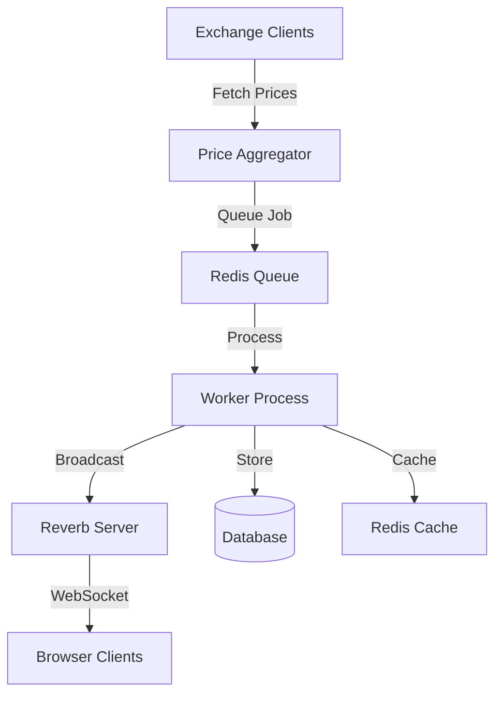

# Crypto Price Aggregator

A real-time cryptocurrency price aggregator built with Laravel, featuring WebSocket communication via Laravel Reverb for live updates.

## Part 1: Project Overview and Installation

### Overview
The Crypto Price Aggregator is a robust system that:
- Fetches cryptocurrency prices from multiple exchanges (Binance, MEXC, Huobi)
- Aggregates and processes price data in real-time
- Broadcasts updates via WebSocket using Laravel Reverb
- Provides a responsive UI with real-time updates using Livewire

### Technology Stack
- PHP 8.2+
- Laravel 11.x
- MySQL 8.0+
- Redis
- Laravel Reverb for WebSocket
- Laravel Livewire
- Supervisor
- Apache/Nginx

### Prerequisites
- Docker and Docker Compose (for containerized setup)
- Composer
- Node.js and NPM
- SSL Certificate (for production)

### Quick Start with Docker

```bash
# Clone the repository
git clone https://github.com/yourusername/crypto-aggregator
cd crypto-aggregator

# Copy environment file
cp .env.example .env

# Start all services
docker-compose up -d

# Install dependencies
docker-compose exec app composer install
docker-compose exec app npm install
docker-compose exec app npm run build

# Run migrations
docker-compose exec app php artisan migrate

# Generate application key
docker-compose exec app php artisan key:generate
```

### Manual Installation

#### Clone the Repository

```bash
git clone https://github.com/yourusername/crypto-aggregator
cd crypto-aggregator
```

#### Install Dependencies

```bash
composer install
npm install
npm run build
```

#### Configure Environment

```bash
cp .env.example .env
php artisan key:generate
```

#### Configure Supervisor

Create supervisor configurations:

For Crypto Worker (`/etc/supervisor/conf.d/crypto-worker.conf`):

```ini
[program:crypto-worker]
process_name=%(program_name)s_%(process_num)02d
command=php /path/to/your/project/artisan queue:work --queue=crypto-prices --timeout=60
autostart=true
autorestart=true
stopasgroup=true
killasgroup=true
user=www-data
numprocs=2
redirect_stderr=true
stdout_logfile=/path/to/your/project/storage/logs/worker.log
stopwaitsecs=30
```

For Reverb (`/etc/supervisor/conf.d/reverb.conf`):

```ini
[program:reverb]
process_name=%(program_name)s_%(process_num)02d
command=/usr/bin/php /path/to/your/project/artisan reverb:start --debug
directory=/path/to/your/project
autostart=true
autorestart=true
user=www-data
numprocs=1
redirect_stderr=true
stdout_logfile=/var/log/supervisor/reverb.log
stopwaitsecs=3600
```

#### Configure Web Server

For Apache (`/etc/apache2/sites-available/your-site.conf`):

```apache
# WebSocket configuration for Reverb
ProxyRequests Off
ProxyPreserveHost On

# Reverb WebSocket Proxy
ProxyPass /app/ ws://127.0.0.1:8080/app/
ProxyPassReverse /app/ ws://127.0.0.1:8080/app/

# Reverb API Proxy
ProxyPass /apps/ http://127.0.0.1:8080/apps/
ProxyPassReverse /apps/ http://127.0.0.1:8080/apps/

# WebSocket upgrade rules
RewriteEngine On
RewriteCond %{HTTP:Upgrade} =websocket [NC]
RewriteCond %{HTTP:Connection} =Upgrade [NC]
RewriteRule /app/(.*) ws://127.0.0.1:8080/app/$1 [P,L,NE]
```

For Nginx:

```nginx
# WebSocket configuration
map $http_upgrade $connection_upgrade {
    default upgrade;
    ''      close;
}

server {
    # ... other configurations ...

    # Reverb WebSocket
    location /app/ {
        proxy_pass http://127.0.0.1:8080;
        proxy_http_version 1.1;
        proxy_set_header Upgrade $http_upgrade;
        proxy_set_header Connection $connection_upgrade;
        proxy_set_header Host $host;
        proxy_cache_bypass $http_upgrade;
    }

    # Reverb API
    location /apps/ {
        proxy_pass http://127.0.0.1:8080;
        proxy_http_version 1.1;
        proxy_set_header Host $host;
        proxy_set_header X-Real-IP $remote_addr;
    }
}
```

#### Start Services

```bash
# Reload supervisor
sudo supervisorctl reread
sudo supervisorctl update
sudo supervisorctl start all

# Restart web server
# For Apache
sudo systemctl restart apache2
# For Nginx
sudo systemctl restart nginx
```
# System Architecture

## Core Components

### Price Fetching Layer

```
├── Exchange Clients
│   ├── Binance Client
│   ├── MEXC Client
│   └── Huobi Client
└── Price Aggregator Service
```

- Implements parallel price fetching from multiple exchanges
- Handles exchange-specific API formats and error cases
- Aggregates prices using weighted averages

### Data Processing Layer

```
├── Queue System (Redis)
│   └── Crypto Price Jobs
├── Event Broadcasting
│   └── Reverb WebSocket Server
└── Cache Layer (Redis)
```

- Processes price updates asynchronously
- Ensures real-time data transmission
- Caches responses for performance

### Database Layer

```
├── Crypto Pairs
├── Exchange Information
├── Price History
└── Aggregated Statistics
```

- Stores historical price data
- Maintains exchange metadata
- Tracks aggregated statistics

### Frontend Layer

```
├── Livewire Components
│   ├── Price Grid
│   ├── Price Cards
│   └── Digital Clock
└── WebSocket Listeners
```

- Real-time UI updates
- Responsive design
- Price change animations

---

## Communication Flow



---

## Service Integration

### Supervisor Processes

- **Crypto Worker**: Handles price fetching and processing
- **Reverb Server**: Manages WebSocket connections

```bash
crypto-worker
├── Process 1 (Primary Queue Worker)
└── Process 2 (Backup Worker)

reverb
└── Single WebSocket Server Process
```

### Proxy Configuration

```
Web Server (Apache/Nginx)
├── HTTP Traffic
│   └── Laravel Application
└── WebSocket Traffic
    └── Reverb Server (Port 8080)
```

---

## Data Flow

### Price Update Cycle

```
1. Fetch Prices -> 2. Process Data -> 3. Store History -> 4. Broadcast Update
```

### Client Update Cycle

```
1. WebSocket Connection -> 2. Subscribe to Channel -> 3. Receive Updates -> 4. Update UI
```

---

## Security Measures

### API Security

- Rate limiting
- Request validation
- Error handling

### WebSocket Security

- Authentication
- Connection encryption
- Channel authorization

### Data Security

- Input sanitization
- SQL injection prevention
- XSS protection

---

# Design Decisions and Trade-offs

## Key Design Decisions

### 1. Real-time Architecture
**Decision**: Laravel Reverb for WebSocket communication

```php
BROADCAST_DRIVER=reverb
```

**Pros**:
- Native Laravel integration
- Built-in scaling capabilities
- Easier deployment and maintenance

**Cons**:
- Newer technology with less community support
- Limited documentation compared to alternatives

---

### 2. Data Processing Strategy
**Decision**: Queue-based processing with Redis

```php
QUEUE_CONNECTION=redis
CACHE_DRIVER=redis
```

**Pros**:
- Asynchronous processing
- Better error handling
- Reduced system load

**Cons**:
- Additional infrastructure requirement
- Potential message delays
- More complex debugging

---

### 3. Exchange Integration
**Decision**: Abstract Factory Pattern for Exchange Clients

```php
class ExchangeFactory
{
    public static function create(string $exchangeName): ExchangeClientInterface
    {
        return match($exchangeName) {
            'binance' => new BinanceExchange(),
            'mexc' => new MexcExchange(),
            'huobi' => new HuobiExchange(),
            default => throw new ExchangeException("Unsupported exchange")
        };
    }
}
```

**Pros**:
- Easy to add new exchanges
- Consistent interface
- Isolated exchange-specific code

**Cons**:
- Additional abstraction layer
- Potential over-engineering for simple cases

---

### 4. Frontend Implementation
**Decision**: Livewire + AlpineJS

```php
class PriceCard extends Component
{
    public $symbol;
    public $price;
    // ...
}
```

**Pros**:
- Reduced JavaScript complexity
- Server-side rendering
- Progressive enhancement

**Cons**:
- Higher server load
- More complex state management
- Limited client-side flexibility

---

### 5. Data Storage
**Decision**: Mixed Storage Strategy

```php
# Real-time Data: Redis
REDIS_CLIENT=predis

# Historical Data: MySQL
DB_CONNECTION=mysql
```

**Pros**:
- Optimized for different access patterns
- Better scalability
- Improved performance

**Cons**:
- More complex infrastructure
- Potential data consistency issues
- Higher operational complexity

---

### 6. Process Management
**Decision**: Supervisor for Process Control

```ini
[program:crypto-worker]
numprocs=2
```

**Pros**:
- Reliable process management
- Automatic restart on failure
- Easy scaling

**Cons**:
- Additional configuration required
- System resource overhead
- More complex deployment

---

## Alternative Approaches Considered

### 1. WebSocket Solutions
- **Pusher**: Hosted solution, but costly at scale
- **Socket.io**: More complex setup with Laravel
- **Laravel Echo Server**: Less actively maintained

---

### 2. Price Fetching Strategies
- **Direct API Calls**: Simpler but less reliable
- **Webhooks**: Not supported by all exchanges
- **Streaming APIs**: Higher resource usage

---

### 3. Frontend Frameworks
- **Vue.js**: More complex setup
- **React**: Overkill for requirements
- **Server-Side Only**: Limited user experience

---

## Summary of Trade-offs
| **Decision**               | **Pros**                                                                 | **Cons**                                                                 |
|-----------------------------|--------------------------------------------------------------------------|--------------------------------------------------------------------------|
| Laravel Reverb              | Native integration, easier deployment                                   | Limited community support, newer technology                              |
| Queue-based Processing      | Asynchronous, better error handling                                     | Additional infrastructure, potential delays                             |
| Abstract Factory Pattern    | Easy to add new exchanges, consistent interface                         | Over-engineering for simple cases                                       |
| Livewire + AlpineJS         | Reduced JavaScript complexity, server-side rendering                   | Higher server load, limited client-side flexibility                     |
| Mixed Storage Strategy      | Optimized for different access patterns, better scalability            | Complex infrastructure, potential consistency issues                   |
| Supervisor for Processes    | Reliable process management, automatic restart                         | Additional configuration, system resource overhead                     |

# Known Issues, Limitations, and Potential Improvements

## Known Issues

### 1. Price Fetching Issues

```php
// Current Implementation Limitations
class PriceFetcherService {
    protected function handleFailedFetch($exchange, $error) {
        Log::error("Failed to fetch from $exchange: {$error->getMessage()}");
        // Currently only logs the error
    }
}
```

- **No automatic fallback** when an exchange API fails
- **Limited retry mechanism** for failed requests
- **No circuit breaker implementation**

---

### 2. WebSocket Connection Handling

```javascript
// Current WebSocket reconnection logic
window.Echo.connector.pusher.connection.bind('disconnected', () => {
    // Simple reconnection attempt
    if (document.visibilityState === 'visible') {
        window.Echo.connector.pusher.connect();
    }
});
```

- **Basic reconnection strategy**
- **No exponential backoff**
- **Limited connection state management**

---

### 3. Database Performance

```php
// Current aggregate query
public function getLatestPrices() {
    return PriceAggregate::with(['pair'])
        ->latest('calculated_at')
        ->get();
}
```

- **No data partitioning**
- **Growing table sizes**
- **No automated data cleanup**

---

## Current Limitations

### 1. Scalability Constraints

```ini
# Current worker configuration
[program:crypto-worker]
numprocs=2
```

- Limited to **single server deployment**
- Fixed number of worker processes
- No **automatic scaling**

---

### 2. Data Retention

```php
// No current data retention policy
class PriceAggregate extends Model
{
    // Missing data lifecycle management
}
```

- **Indefinite data storage**
- No **archiving strategy**
- Growing storage requirements

---

### 3. Exchange Support

```php
protected array $supportedPairs = [
    'BTCUSDT', 
    'BTCUSDC', 
    'ETHBTC'
];
```

- Limited number of **trading pairs**
- Fixed exchange list
- No **dynamic pair discovery**

---

## Potential Improvements

### 1. Enhanced Error Handling

```php
class ExchangeClient
{
    public function withCircuitBreaker()
    {
        // TODO: Implement circuit breaker
    }

    public function withRetry()
    {
        // TODO: Implement retry mechanism
    }
}
```

- **Circuit breaker pattern** to prevent cascading failures
- **Retry mechanism** with exponential backoff
- **Fallback strategies** for failed API calls

---

### 2. Performance Optimizations

```php
// Proposed improvements
class PriceRepository
{
    public function getPartitionedData()
    {
        // TODO: Implement table partitioning
    }

    public function withCaching()
    {
        // TODO: Implement caching strategy
    }
}
```

- **Table partitioning** for historical data
- **Caching strategy** for frequently accessed data
- **Index optimization** for faster queries

---

### 3. Scaling Capabilities

```yaml
# Future Docker Swarm/Kubernetes config
services:
  crypto-worker:
    deploy:
      replicas: 3
      resources:
        limits:
          cpus: '0.50'
          memory: 512M
      restart_policy:
        condition: on-failure
```

- **Container orchestration** with Docker Swarm or Kubernetes
- **Horizontal scaling** for worker processes
- **Resource management** for optimal performance

---

### 4. Advanced Features

```php
// Planned features
class PriceAnalytics
{
    public function calculateVolatility()
    {
        // TODO: Implement volatility calculation
    }

    public function detectAnomalies()
    {
        // TODO: Implement anomaly detection
    }
}
```

- **Volatility calculation** for price trends
- **Anomaly detection** for unusual price movements
- **Predictive analytics** for price forecasting

---

### 5. Monitoring and Alerts

```php
// Monitoring implementation
class SystemMonitor
{
    public function checkSystemHealth()
    {
        // TODO: Implement health checks
    }

    public function alertOnThreshold()
    {
        // TODO: Implement alerting
    }
}
```

- **System health checks** for critical components
- **Threshold-based alerts** for performance issues
- **Dashboard integration** for real-time monitoring

---

## Summary of Improvements

| **Area**                  | **Current State**                          | **Proposed Improvement**                  |
|---------------------------|--------------------------------------------|-------------------------------------------|
| **Error Handling**         | Basic logging, no retries                  | Circuit breaker, retry mechanism          |
| **WebSocket Handling**     | Simple reconnection logic                  | Exponential backoff, state management     |
| **Database Performance**   | No partitioning, growing tables            | Table partitioning, caching strategy      |
| **Scalability**            | Single server, fixed workers               | Container orchestration, auto-scaling     |
| **Data Retention**         | Indefinite storage, no archiving           | Data lifecycle management, archiving      |
| **Exchange Support**       | Limited pairs, fixed exchange list         | Dynamic pair discovery, more exchanges    |
| **Advanced Features**      | Basic price aggregation                    | Volatility calculation, anomaly detection |
| **Monitoring**             | No monitoring or alerts                    | Health checks, threshold-based alerts     |

# Testing and Development Guidelines

## Testing Strategy

### 1. Unit Tests

```php
class ExchangeClientTest extends TestCase
{
    use RefreshDatabase;

    protected function setUp(): void
    {
        parent::setUp();
        $this->exchange = new BinanceExchange();
    }

    /** @test */
    public function it_validates_supported_pairs()
    {
        $testCases = [
            'BTCUSDT' => true,
            'BTCUSDC' => true,
            'ETHBTC' => true,
            'INVALID' => false
        ];

        foreach ($testCases as $pair => $expected) {
            $this->assertEquals($expected, $this->exchange->isSymbolSupported($pair));
        }
    }
}
```

- **Purpose**: Test individual components in isolation.
- **Coverage**: Validate business logic, edge cases, and error handling.
- **Tools**: PHPUnit, Mockery for mocking dependencies.

---

### 2. Integration Tests

```php
class PriceFetcherServiceTest extends TestCase
{
    /** @test */
    public function it_fetches_and_processes_price_data()
    {
        $service = app(PriceFetcherService::class);
        $result = $service->fetchAllPrices();

        $this->assertArrayHasKeys([
            'price',
            'volume',
            'timestamp'
        ], $result);
    }
}
```

- **Purpose**: Test interactions between components.
- **Coverage**: Ensure data flows correctly between services.
- **Tools**: PHPUnit, Laravel's testing utilities.

---

### 3. WebSocket Tests

```php
class WebSocketTest extends TestCase
{
    /** @test */
    public function it_broadcasts_price_updates()
    {
        Event::fake();

        $prices = $this->generateTestPriceData();
        event(new CryptoPricesUpdated($prices));

        Event::assertDispatched(CryptoPricesUpdated::class);
    }
}
```

- **Purpose**: Validate WebSocket communication and event broadcasting.
- **Coverage**: Ensure real-time updates are correctly sent and received.
- **Tools**: Laravel Reverb, Event faking.

---

## Development Guidelines

### 1. Code Style

```php
// PSR-12 Coding Standard
class ExampleClass
{
    private string $property;

    public function exampleMethod(): void
    {
        // 4 spaces for indentation
        if ($condition) {
            $this->doSomething();
        }
    }
}
```

- **Standard**: Follow **PSR-12** coding standards.
- **Indentation**: Use **4 spaces** for indentation.
- **Naming**: Use **camelCase** for variables and methods, **PascalCase** for classes.

---

### 2. Git Workflow

```bash
# Branch Naming Convention
feature/add-new-exchange
bugfix/fix-websocket-connection
hotfix/critical-price-update

# Commit Message Format
git commit -m "feat: add support for new exchange"
git commit -m "fix: resolve websocket disconnection issues"
```

- **Branch Naming**: Use `feature/`, `bugfix/`, or `hotfix/` prefixes.
- **Commit Messages**: Follow **Conventional Commits** format (`feat:`, `fix:`, `chore:`, etc.).
- **Workflow**: Use **feature branches** and **pull requests** for code reviews.

---

### 3. Documentation Standards

```php
/**
 * Fetches current price from exchange
 *
 * @param string $symbol Trading pair symbol
 * @return array{
 *     price: float,
 *     volume: float,
 *     timestamp: int
 * }
 * @throws ExchangeException
 */
public function getPrice(string $symbol): array
{
    // Implementation
}
```

- **Inline Comments**: Use PHPDoc for methods and classes.
- **Documentation**: Maintain a `README.md` for setup and usage.
- **API Docs**: Use tools like **Swagger** or **Postman** for API documentation.

---

### 4. Testing Requirements

```php
// Test Coverage Requirements
class CoverageRequirements
{
    const MINIMUM_COVERAGE = 80;
    const CRITICAL_PATHS = [
        'PriceFetcher',
        'ExchangeClient',
        'WebSocket'
    ];
}
```

- **Coverage**: Maintain **80%+ test coverage**.
- **Critical Paths**: Ensure 100% coverage for critical components.
- **Tools**: Use **PHPUnit** for coverage reports.

---

### 5. Environment Setup

```bash
# Development Environment Setup
composer install
npm install
cp .env.example .env
php artisan key:generate
php artisan migrate
npm run dev

# Testing Environment
composer test
composer test:coverage
```

- **Local Setup**: Use Docker or Homestead for consistent environments.
- **Testing**: Run tests with `composer test` and check coverage with `composer test:coverage`.
- **CI/CD**: Integrate with GitHub Actions or GitLab CI for automated testing.

---

### 6. Review Process

```php
// Code Review Checklist
class ReviewChecklist
{
    public static array $requirements = [
        'Tests Added/Updated',
        'Documentation Updated',
        'Error Handling Implemented',
        'Performance Considered',
        'Security Reviewed'
    ];
}
```

- **Checklist**: Use a standardized checklist for code reviews.
- **Focus Areas**:
  - **Tests**: Ensure new code is covered by tests.
  - **Documentation**: Verify inline and external documentation.
  - **Error Handling**: Check for proper exception handling.
  - **Performance**: Optimize for efficiency.
  - **Security**: Validate input sanitization and authentication.

---

## Summary of Testing and Development Guidelines

| **Aspect**               | **Guidelines**                                                                 |
|--------------------------|-------------------------------------------------------------------------------|
| **Unit Tests**           | Test individual components in isolation with PHPUnit.                         |
| **Integration Tests**    | Validate interactions between components using Laravel testing tools.         |
| **WebSocket Tests**      | Ensure real-time updates are correctly broadcast and received.                |
| **Code Style**           | Follow PSR-12 standards with consistent naming and indentation.              |
| **Git Workflow**         | Use feature branches, conventional commits, and pull requests.                |
| **Documentation**        | Maintain PHPDoc, README, and API documentation.                              |
| **Testing Requirements** | Achieve 80%+ test coverage with 100% coverage for critical paths.            |
| **Environment Setup**    | Use Docker or Homestead for local development and CI/CD for testing.         |
| **Code Reviews**         | Follow a checklist to ensure tests, documentation, and security are covered. |

# Deployment and Production Guidelines

## Docker Configuration

### 1. Dockerfile

```dockerfile
FROM php:8.2-fpm

# Base dependencies
RUN apt-get update && apt-get install -y \
    git \
    curl \
    libpng-dev \
    libonig-dev \
    libxml2-dev \
    zip \
    unzip \
    supervisor \
    nginx

# PHP Extensions
RUN docker-php-ext-install pdo_mysql mbstring exif pcntl bcmath gd

# Composer
COPY --from=composer:latest /usr/bin/composer /usr/bin/composer

# Node.js and NPM
RUN curl -sL https://deb.nodesource.com/setup_18.x | bash -
RUN apt-get install -y nodejs

# Application Setup
WORKDIR /var/www
COPY . .
RUN composer install --no-dev --optimize-autoloader
RUN npm install && npm run build

# Supervisor Configuration
COPY docker/supervisor/crypto-worker.conf /etc/supervisor/conf.d/
COPY docker/supervisor/reverb.conf /etc/supervisor/conf.d/
```

- **Base Image**: PHP 8.2 with FPM.
- **Dependencies**: Includes Git, Curl, and required PHP extensions.
- **Composer**: Installs Composer for dependency management.
- **Node.js**: Installs Node.js and NPM for frontend builds.
- **Supervisor**: Configures Supervisor for process management.

---

### 2. Docker Compose

```yaml
version: '3.8'

services:
  app:
    build:
      context: .
      dockerfile: Dockerfile
    environment:
      - APP_ENV=production
    volumes:
      - .:/var/www
    depends_on:
      - mysql
      - redis

  mysql:
    image: mysql:8.0
    environment:
      MYSQL_DATABASE: ${DB_DATABASE}
      MYSQL_ROOT_PASSWORD: ${DB_PASSWORD}
    volumes:
      - mysql-data:/var/lib/mysql

  redis:
    image: redis:alpine
    volumes:
      - redis-data:/data

  nginx:
    image: nginx:alpine
    ports:
      - "80:80"
      - "443:443"
    volumes:
      - .:/var/www
      - ./docker/nginx/conf.d/:/etc/nginx/conf.d/
    depends_on:
      - app

volumes:
  mysql-data:
  redis-data:
```

- **Services**:
  - `app`: PHP application container.
  - `mysql`: MySQL database container.
  - `redis`: Redis cache container.
  - `nginx`: Nginx web server container.
- **Volumes**: Persistent storage for MySQL and Redis data.
- **Ports**: Exposes HTTP (80) and HTTPS (443) ports.

---

## Production Setup

### 1. Environment Configuration

```bash
# Production Environment Checks
php artisan env:check
php artisan config:cache
php artisan route:cache
php artisan view:cache

# SSL Configuration
certbot --nginx -d yourdomain.com
```

- **Environment Checks**: Validate environment variables.
- **Cache Optimization**: Cache configuration, routes, and views for performance.
- **SSL**: Use Certbot to configure SSL for your domain.

---

### 2. Monitoring Setup

```php
// Health Check Endpoints
Route::get('/health', function () {
    return [
        'status' => 'healthy',
        'services' => [
            'database' => DB::connection()->getPdo() ? 'up' : 'down',
            'redis' => Redis::connection()->ping() ? 'up' : 'down',
            'websocket' => checkWebSocketServer(),
        ]
    ];
});
```

- **Health Checks**: Monitor database, Redis, and WebSocket server status.
- **Tools**: Use tools like **Prometheus** or **New Relic** for advanced monitoring.

---

### 3. Backup Strategy

```bash
# Database Backup
0 */4 * * * mysqldump -u user -p database > /backups/db-$(date +\%Y\%m\%d-\%H).sql

# Application Backup
0 0 * * * tar -czf /backups/app-$(date +\%Y\%m\%d).tar.gz /var/www/
```

- **Database Backups**: Backup MySQL every 4 hours.
- **Application Backups**: Backup the application daily.
- **Storage**: Store backups in a secure, offsite location.

---

### 4. Scaling Configuration

```ini
# Worker Scaling
[program:crypto-worker]
numprocs=%(ENV_WORKER_COUNT)s
process_name=%(program_name)s_%(process_num)02d

# Redis Cluster
REDIS_CLUSTER=true
REDIS_CLUSTERS=[
    'cache' => [
        'host' => env('REDIS_CACHE_HOST', '127.0.0.1'),
        'port' => env('REDIS_CACHE_PORT', 6379),
    ]
]
```

- **Worker Scaling**: Scale worker processes dynamically.
- **Redis Cluster**: Use Redis clusters for high availability.

---

### 5. Deployment Script

```bash
#!/bin/bash

# Deploy Script
echo "Starting deployment..."

# Pull latest changes
git pull origin main

# Install dependencies
composer install --no-dev --optimize-autoloader
npm install --production
npm run build

# Clear caches
php artisan config:clear
php artisan cache:clear
php artisan view:clear

# Update database
php artisan migrate --force

# Restart services
supervisorctl restart all
systemctl restart nginx

echo "Deployment completed."
```

- **Steps**:
  - Pull latest code.
  - Install dependencies.
  - Clear caches.
  - Run migrations.
  - Restart services.

---

### 6. Production Checklist

```php
class ProductionChecklist
{
    public static array $items = [
        'SSL Certificates Updated',
        'Environment Variables Set',
        'Caches Warmed',
        'Database Backups Configured',
        'Monitoring Tools Active',
        'Error Logging Configured',
        'Rate Limiting Enabled',
        'Security Headers Set',
        'Supervisor Running',
        'Queue Workers Active'
    ];
}
```

- **Checklist**: Ensure all critical production tasks are completed.
- **Items**:
  - SSL certificates.
  - Environment variables.
  - Caches and backups.
  - Monitoring and error logging.
  - Security and process management.

---

## Summary of Deployment and Production Guidelines

| **Aspect**               | **Guidelines**                                                                 |
|--------------------------|-------------------------------------------------------------------------------|
| **Docker Configuration** | Use Dockerfile and Docker Compose for containerized deployment.               |
| **Environment Setup**    | Validate environment variables, cache configurations, and SSL certificates.   |
| **Monitoring**           | Implement health checks and use monitoring tools like Prometheus.             |
| **Backups**              | Schedule regular database and application backups.                            |
| **Scaling**              | Scale workers dynamically and use Redis clusters for high availability.       |
| **Deployment Script**    | Automate deployment steps with a script.                                     |
| **Production Checklist** | Use a checklist to ensure all production tasks are completed.                 |
